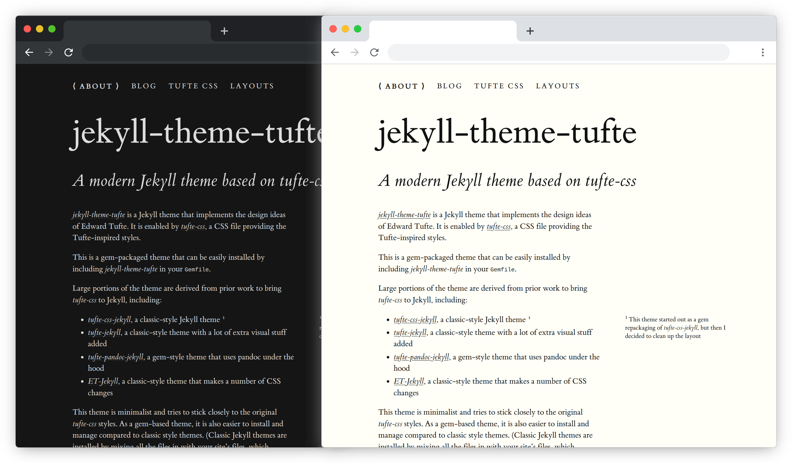

# jekyll-theme-tufte

## *A modern Jekyll theme based on [tufte-css](https://github.com/edwardtufte/tufte-css)*

*jekyll-theme-tufte* is a [Jekyll](https://jekyllrb.com) static website theme inspired by the text design of Edward
Tufte. It is enabled by [*tufte-css*](https://github.com/edwardtufte/tufte-css),
a CSS file providing the Tufte styles.

This is a gem-packaged theme that can be easily installed by including
*jekyll-theme-tufte* in your `Gemfile`.

Large portions of the theme are derived from prior work to bring *tufte-css* to Jekyll, including:

* [*tufte-css-jekyll*](https://github.com/sdruskat/tufte-css-jekyll), a classic-style Jekyll theme
* [*tufte-jekyll*](https://github.com/clayh53/tufte-jekyll), a classic-style theme with a lot of extra visual stuff added
* [*tufte-pandoc-jekyll*](https://github.com/jez/tufte-pandoc-jekyll), a gem-style theme that uses pandoc under the hood
* [*ET-Jekyll*](https://github.com/bradleytaunt/ET-Jekyll), a classic-style theme that makes a number of CSS changes

This theme is minimalist and tries to stick closely to the original tufte-css styles. As a gem-based theme, it is also easier to install and manage compared to classic style themes. (Classic Jekyll themes are installed by mixing all the files in with your site’s files, which creates a big mess.)

This theme is responsive and adapts to desktop and mobile screens. (Margin notes
are displayed inline on narrow screens.) It also supports dark mode detection
via `prefers-color-scheme`, looking good on dark and light backgrounds alike.

### [Try out the demo!](https://ab.github.io/jekyll-theme-tufte/)

[](https://ab.github.io/jekyll-theme-tufte/)

## Installation

Add this line to your Jekyll site's `Gemfile`:

```ruby
gem 'jekyll-theme-tufte'
```

And add these lines to your Jekyll site's `_config.yml`:

```yaml
theme: jekyll-theme-tufte
plugins:
  - jekyll-theme-tufte
```

(Adding the theme to the plugins list is necessary if you want to use the
custom Liquid template tags like ``. If you already have a
plugins list, append `- jekyll-theme-tufte` to the list.)

Then, to install all the gem dependencies, run:

    $ bundle

Or install it manually with:

    $ gem install jekyll-theme-tufte

## Usage

If you are new to Jekyll, check out the [Jekyll documentation](https://jekyllrb.com/docs/home/) first.

### Some theme specifics

- The **large site title (and subtitle)** can be switched on/off by setting the value for `header` in `_config.yml` to false.

- The nav menu page order and titles can be configured in the YAML front matter at the top of each page. See [Available Page Layouts](https://ab.github.io/jekyll-theme-tufte/page/layouts) in the demo site for more info.

## Contributing

Bug reports and pull requests are welcome on GitHub at https://github.com/ab/jekyll-theme-tufte. This project is intended to be a safe, welcoming space for collaboration, and contributors are expected to adhere to the [Contributor Covenant](https://www.contributor-covenant.org/) code of conduct.

## Development of the theme

To set up your environment to develop this theme, clone the theme and run `bundle install`.

Themes work much like normal Jekyll sites, so to test changes to the theme, run `bundle exec jekyll serve -w` and open your browser at `http://localhost:4000/jekyll-theme-tufte/`. This starts a Jekyll server running the theme demo site.

Only files listed in the regex in the gemspec are included in the published theme. Custom directories can be added by editing the regex in `jekyll-theme-tufte.gemspec`.

## License

The theme is available as open source under the terms of the [MIT License](https://opensource.org/licenses/MIT).
